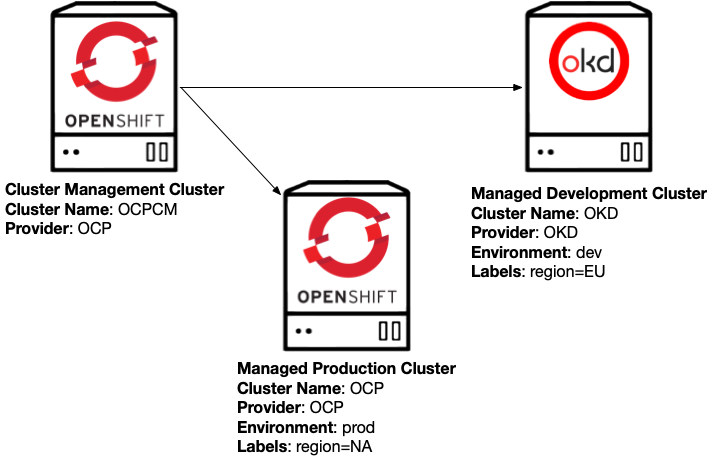
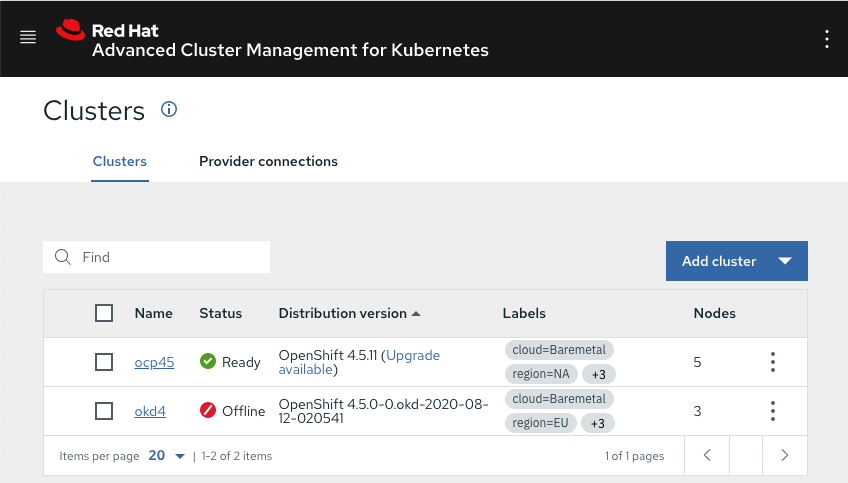
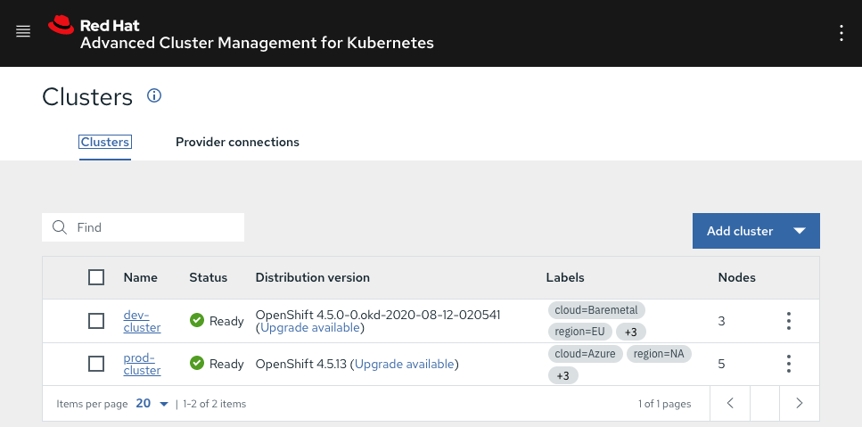
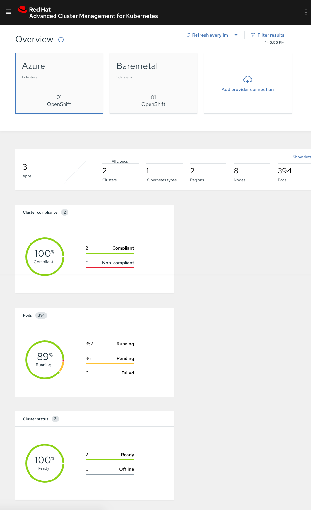
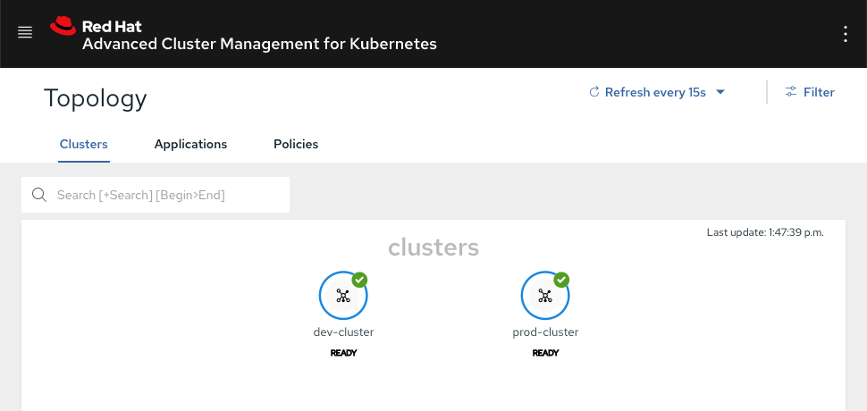
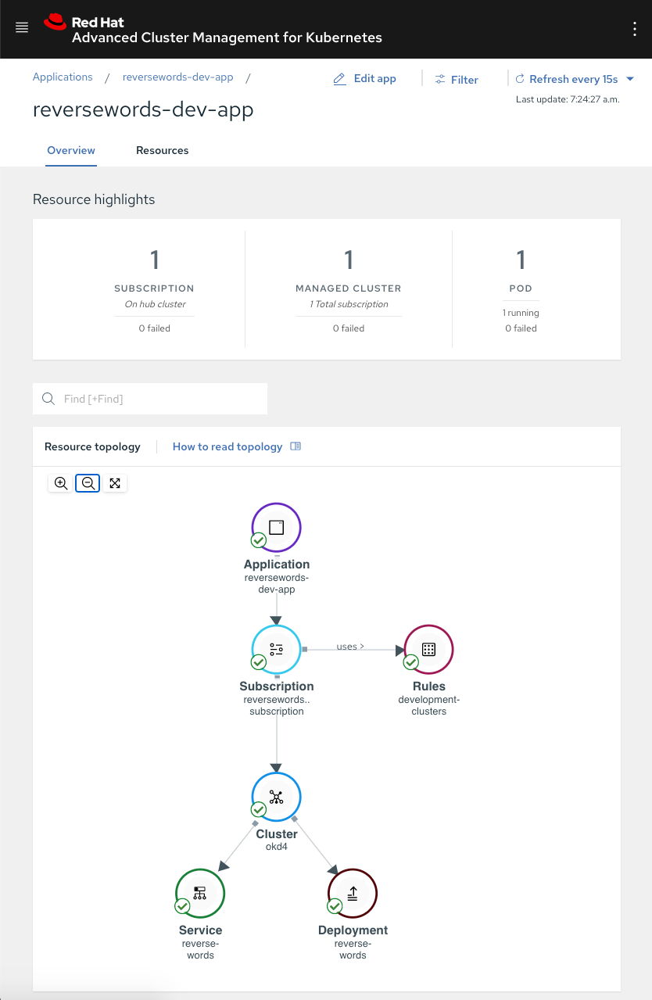

# Multiple Application Environments with Red Hat Advanced Cluster Management

> Based on the blog _**Applications Here, Applications There**_ by Mario Vázquez [source](https://www.openshift.com/blog/applications-here-applications-there-part-1-deploying-an-application-to-multiple-environments)

Red Hat Advanced Cluster Management features complete Application Life-cycle capabilities. Below we will explore some of the GitOps capabilities built into the Red Hat Advanced Cluster Management.

## Application Life-cycle

The possibilities offered by Red Hat Advanced Cluster Management with regards to application life-cycle are plentiful. In this demonstration, we are going to focus on Advanced Cluster Manager and its GitOps capabilities for the following use cases:

- Deploying an Application to Multiple Environments
- Blue-green Deployment
- Application Migration
- Disaster Recovery

## Cluster Architecture

Below is the architecure used for this demonstration.



> **NOTE**: The labels used within this example are reused throughout the demonstration.

Red Hat Advanced Cluster Management uses a hub cluster/managed cluster model for managing the different connected clusters, the hub cluster is where Red Hat Advanced Cluster Management is running, the managed clusters are the clusters that are managed by Red Hat Advanced Cluster Management.

## Clusters

Three OpenShift clusters are used for this demonstration.

1. **Red Hat Advanced Cluster Manager**

    Red Hat Advanced Cluster Manager runs within it's own OpenShift cluster. In this example, it is running on VMware with three masters, and two worker nodes.

1. **Development Cluster**

    The managed Development cluster, named `dev-cluster`, is deployed in the _EU_ region in a three node (all master) bare metal cluster.

1. **Production Cluster**

    The  managed Production cluster, named `prod-cluster`, is deployed in the _NA_ region on a five node (three managers and two worker nodes) Azure clsuter.

### Cluster Components

| Component                                          | Version                       |
| :------------------------------------------------- | :---------------------------- |
| Red Hat OpenShift Container Platform               | 4.5.11                        |
| OKD OpenShift Container Platform                   | 4.5.0-0.okd.2020-08-12-020541 |
| Red Hat Advanced Cluster Management for Kubernetes | 2.0.3                         |

## Components

Components for GitOps and Red Hat Advanced Cluster Management.

### Channels

Channels point to a physical  place where resources are stored for deployment. For this write-up we  are going to use Channels of type `Git`, there are different channel types for Helm, Namespaces, etc. [Learn More](https://access.redhat.com/documentation/en-us/red_hat_advanced_cluster_management_for_kubernetes/2.0/html/manage_applications/managing-applications#creating-and-managing-channels)

### PlacementRules

You can create and manage  placement rules to define where subscriptions to Kubernetes resources  and Helm releases are deployed. Use placement rules to help you  facilitate multi-cluster deployments of your Kubernetes resources. [Learn More](https://access.redhat.com/documentation/en-us/red_hat_advanced_cluster_management_for_kubernetes/2.0/html/manage_applications/managing-applications#creating-and-managing-placement-rules)

### Subscriptions

Subscriptions serve as sets of definitions for identifying Kubernetes resources within Channels by using annotations, labels, and versions.

Subscription resources are  defined on the hub and propagated to the managed cluster(s). The Subscription controller watches the source location (Channel) for new or updated resources. When a new or updated Kubernetes resource is  detected, the Subscription controller can download the resource directly from the source location (channel) to managed clusters without checking the Hub cluster first (because the Subscription was initially propagated).

The Subscription can filter the Helm releases to select a specific chart version. For this case, the Subscription controller checks the version parameter to identify the  Helm release (chart) version to select. [Learn More](https://access.redhat.com/documentation/en-us/red_hat_advanced_cluster_management_for_kubernetes/2.0/html/manage_applications/managing-applications#creating-and-managing-subscriptions)

### Applications

An Application object  provides a way for you to aggregate subscriptions as a group. It  provides tooling and a console with a resource that allows for the  aggregation and display of all the components in the Application. [Learn More](https://access.redhat.com/documentation/en-us/red_hat_advanced_cluster_management_for_kubernetes/2.0/html/manage_applications/managing-applications#managing-application-resources)

### Git Repository

GitOps patterns are followed to deploy the applications, the different manifests required to deploy the applications in the different environments will be stored in a Git repository, the Git structure is defined in the following table:

| Branch   | Description                                                  |
| :------- | :----------------------------------------------------------- |
| `config` | Stores the base files for the applications, which apply to every environment |
| `prod`   | Stores the overlay files for the applications, which apply to production environments |
| `stage`  | Stores the overlay files for the applications, which apply to staging environments |

> **NOTE**: There are multiple ways to organise the Git repository, Red Hat Advanced Cluster Management allows any method.

## Deploying an Application to Multiple Environments

Red Hat Advanced Cluster Management can deploy applications to multiple environments. The application used for this demonstration is a simple web-service that reverses words. This web-service has two releases, the `stage` release which is the version the development team is testing at the moment and the `production` release, which is the version the customers are using.

Red Hat Advanced Cluster Management includes support for [Kustomize](https://kustomize.io/), which allows for application configuration based on the destination environments.

The application is the same for both environments, but the release will be different depending on the environment the application is deployed to.

Deployment of the applications will be all command line through the use of the OpenShift `oc` tool, and a set of `yaml` manifests with the required configurations for Red Hat Advanced Cluster Management that define a Channel, Subscription, and PlacementRule. As stated, everything will be done via the command line, but could also be performed from the web console, as well.

### CLI Profiles

As the environment consists of three kubernetes clusters, we are using **_contexts_** to run commands against each cluster. The contexts are defined in the `~/.kube/config` file and invoked as follows:

```bash
oc --context prod get nodes
NAME                             STATUS   ROLES    AGE   VERSION
ocp45-master1.ocp.highvail.com   Ready    master   14d   v1.18.3+47c0e71
ocp45-master2.ocp.highvail.com   Ready    master   14d   v1.18.3+47c0e71
ocp45-master3.ocp.highvail.com   Ready    master   14d   v1.18.3+47c0e71
ocp45-worker1.ocp.highvail.com   Ready    worker   14d   v1.18.3+47c0e71
ocp45-worker2.ocp.highvail.com   Ready    worker   14d   v1.18.3+47c0e71
```

#### Contexts

The following are the contexts used in this demonstration

| Context | Description                                                         |
| :------ | :------------------------------------------------------------------ |
| `hub`   | CLI Profile connected to the **_hub_** Cluster (where Red Hat Advanced Cluster Manager is deployed) running OCP  |
| `dev`   | CLI Profile connected to the managed **_development_** cluster (`dev-cluster`) running OKD|
| `prod`  | CLI Profile connected to the managed **_production_** cluster (`prod-cluster`) running OCP|

More about CLI profiles and contexts [here](https://docs.openshift.com/container-platform/3.11/cli_reference/manage_cli_profiles.html).

## Examples

Review of the resources used with examples. All these yaml manifests can be found in the git repository.  Remember to check all branches as they are not all seen form the default branch.

### Channel Example

The Channel is defined as type _**Git**_  that will be used by the associated Subscriptions in order to obtain the Kubernetes resources that deploy the application.

In this case, it is configured to get the Kubernetes resources from the Git repository at `github.com/zombiefish/acm-app-lifecycle.git`.

```yaml
apiVersion: apps.open-cluster-management.io/v1
kind: Channel
metadata:
  name: acm-app-lifecycle
  namespace: open-cluster-management
spec:
  type: Git
  pathname: https://github.com/zombiefish/acm-app-lifecycle.git
```

### Namespace Example

When using Subscriptions, the Namespace holding the Subscription will be propagated to the destination cluster. Below, we are creating a Namespace named `reverse-words-stage` that will be propagated to the development clusters by the Subscription.

```yaml
apiVersion: v1
kind: Namespace
metadata:
  name: reverse-words-stage
```

### PlacementRule Example

Subscriptions are propagated to a set of clusters defined by a PlacementRule. This allows the selection of a cluster or group of custers from the different environments and make that list available to the different Subscriptions.

The PlacementRule named development-clusters will return all clusters which are marked as _available_ and that match the label `environment: dev`, in this scenario, this PlacementRule will return the managed development cluster named `dev-cluster`.

```yaml
apiVersion: apps.open-cluster-management.io/v1
kind: PlacementRule
metadata:
  name: development-clusters
  namespace: reverse-words-stage
spec:
  clusterConditions:
  - type: "ManagedClusterConditionAvailable"
    status: "True"
  clusterSelector:
    matchExpressions: []
    matchLabels:
      environment: "dev"
```

### Subscription Example

The Subscription will deploy the Kubernetes resources required (obtained from a given Channel) a set of clusters (obtained from a given PlacementRule). You can also define where the Kubernetes resources are located within the Git repository (Channel).

This Subscription uses the Channel defined earlier, and will get the Kubernetes resources from the branch `stage`. Within that branch, it will look for Kubernetes resources in the `apps/reversewords/` path.

```yaml
apiVersion: apps.open-cluster-management.io/v1
kind: Subscription
metadata:
  name: reversewords-dev-app-subscription
  namespace: reverse-words-stage
  labels:
    app: reversewords-dev-app
  annotations:
    apps.open-cluster-management.io/git-path: apps/reversewords/
    apps.open-cluster-management.io/git-branch: stage
spec:
  channel: open-cluster-management/acm-app-lifecycle
  placement:
    placementRef:
      kind: PlacementRule
      name: development-clusters
```

### Application Example

And finally, the Application.

```yaml
apiVersion: app.k8s.io/v1beta1
kind: Application
metadata:
  name: reversewords-dev-app
  namespace: reverse-words-stage
spec:
  componentKinds:
  - group: apps.open-cluster-management.io
    kind: Subscription
  descriptor: {}
  selector:
    matchExpressions:
    - key: app
      operator: In
      values:
      - reversewords-dev-app
```

# Part 1 - Deploying an Application to Multiple Environments

When an application is deployed, it is checked against the clusters that are managed by Advanced Cluster Management. If the application matches one or more subscriptions, it will reserve resources in the different clusters.

## Local Environment

For sanity, and less complexity, set a local variable for the rw git content.  In this case, set the path to **_DEMO_**.

```bash
export DEMO="https://raw.githubusercontent.com/
    zombiefish/acm-app-lifecycle/master/acm-manifests"
```

## Deploying the Application to the Development Environment

1. First, create the Channel definition to be used by the Application throught the entire demonstration.

    ```bash
    oc --context hub create \
        -f $DEMO/base/00_channel.yaml

    channel.apps.open-cluster-management.io/acm-app-lifecycle created
    ```

1. Next, create a Namespace for storing the application manifests within the development environment.

    ```bash
    oc --context hub create \
        -f $DEMO/reversewords-stage/00_namespace.yaml

    namespace/reverse-words-stage created
    ```

1. Now create a PlacementRule that matches the managed development cluster.

    ```bash
    oc --context hub create \
        -f $DEMO/reversewords-stage/01_placement_rule.yaml

    placementrule.apps.open-cluster-management.io/development-clusters created
    ```

    Check the PlacementRule status, note that it matches the managed development cluster named `dev-cluster`:

    ```bash
    oc --context hub -n reverse-words-stage
        get placementrule development-clusters -o yaml

    <OMITTED_OUTPUT>
    status:
      decisions:
      - clusterName: dev-cluster
        clusterNamespace: dev-cluster
    ```

1. The Subscription and the Application can be created targeting the development clusters via the placementrule.

    ```bash
    oc --context hub create \
        -f $DEMO/reversewords-stage/02_subscription-dev.yaml

    subscription.apps.open-cluster-management.io/
        reversewords-dev-app-subscription created

    oc --context hub create \
        -f $DEMO/reversewords-stage/03_application-dev.yaml

    application.app.k8s.io/reversewords-dev-app created
    ```

    See the following Subscription status. Note that it says `propagated`, which means the Subscription has been sent to the destination cluster:

    ```bash
    oc --context hub -n reverse-words-stage get
         subscription reversewords-dev-app-subscription -o yaml

    <OMITTED_OUTPUT>
    status:
      lastUpdateTime: "2020-10-05T15:32:00Z"
      phase: Propagated
    ```

1. Looking at the development cluster, see that the Application is up and running.

    ```bash
    oc --context dev -n reverse-words-stage get deployments,services,pods

    NAME                            READY   UP-TO-DATE   AVAILABLE   AGE
    deployment.apps/reverse-words   1/1     1            1           75s

    NAME          TYPE         CLUSTER-IP      EXTERNAL-IP  PORT(S)        AGE
    reverse-words LoadBalancer 172.30.178.135  <pending>    8080:30804/TCP 75s

    NAME                                 READY   STATUS    RESTARTS   AGE
    pod/reverse-words-6dfc7b864b-bbcjc   1/1     Running   0          75s

    ```

    Although the application is up, there is no access the application.

1. To access the Application on the network, the service needs to be exposed.

    ```bash
    oc --context dev create \
        -f $DEMO/reversewords-stage/04_service-route.yaml

    route.route.openshift.io/reverse-words created
    ```

    Get the address of the route just created:

    ```bash
    oc --context dev -n reverse-words-stage get route

    NAME            HOST/PORT
    reverse-words   reverse-words-reverse-words-stage.apps.okd.highvail.com
        PATH   SERVICES        PORT   TERMINATION   WILDCARD
        reverse-words   http                 None
    ```

    > **Note**: If we run the same query against production cluster, we will see that there is no application running there.
    >
    > ```bash
    > oc --context prod -n reverse-words-stage get deployments,services
    >
    > No resources found in reverse-words-stage namespace.
    > ```
    >

    Query the application to see the deployed staging release:

    ```bash
    curl http://reverse-words-reverse-words-stage.apps.okd.highvail.com

    Reverse Words Release: Stage Release v0.0.3. App version: v0.0.3
    ```

## Deploying the Application to the Production Environment

1. No need to create a new Channel since it will be using the same source Git repository, but a different branch.

1. Create a Namespace for storing the Application manifests on the target production cluster.

    ```bash
    oc --context hub create \
         -f $DEMO/reversewords-prod/00_namespace.yaml

    namespace/reverse-words-prod created
    ```

1. Now create a PlacementRule that matches the production clusters:

    ```bash
    oc --context hub create \
        -f $DEMO/reversewords-prod/01_placement_rule.yaml

    placementrule.apps.open-cluster-management.io/production-clusters created
    ```

    See the following PlacementRule status. Note that it matched the managed production cluster named, `prod-cluster`.

    ```bash
    oc --context hub -n reverse-words-prod get
        placementrule  production-clusters -o yaml

    <OMITTED_OUTPUT>
    status:
      decisions:
      - clusterName: prod-cluster
        clusterNamespace: prod-cluster
    ```

1. The Subscription and the Application can be created now targeting the production clusters via the PlacementRule.

    ```bash
    oc --context hub create \
        -f $DEMO/reversewords-prod/02_subscription-pro.yaml

    subscription.apps.open-cluster-management.io/
        reversewords-pro-app-subscription created

    oc --context hub create \
        -f $DEMO/reversewords-prod/03_application-pro.yaml

    application.app.k8s.io/reversewords-pro-app created
    ```

    Check the Subscription status. Note that it says `propagated`, which means the Subscription has been sent to the destination cluster:

    ```bash
    oc --context hub -n reverse-words-prod get
        subscription reversewords-pro-app-subscription -o yaml

    <OMITTED_OUTPUT>
    status:
      message: Active
      phase: Propagated
    ```

1. Finally, look at the production cluster and see the application is up and running.

    ```bash
    oc --context prod -n reverse-words-prod get deployments,services,pods

    NAME                                 READY   STATUS    RESTARTS  AGE
    pod/reverse-words-646456cd7c-5lss4   1/1     Running   0         102s

    NAME          TYPE         CLUSTER-IP  EXTERNAL-IP PORT(S)        AGE
    reverse-words LoadBalancer 172.30.69.224 <pending> 8080:31860/TCP 102s

    NAME                            READY   UP-TO-DATE   AVAILABLE   AGE
    deployment.apps/reverse-words   1/1     1            1           102s

    NAME                                      DESIRED  CURRENT READY AGE
    replicaset.apps/reverse-words-646456cd7c  1        1       1     102s
    ```

1. Again, query the application and see that it deployed the production release.

    ```bash
    oc --context prod -n reverse-words-prod create \
         -f $DEMO/reversewords-prod/04_service-route.yaml

    route.route.openshift.io/reverse-words created
    ```

    Get the address of the route we just created:

    ```bash
    oc --context prod -n reverse-words-prod get route

    NAME            HOST/PORT
    reverse-words   reverse-words-reverse-words-prod.apps.ocp.highvail.com
        PATH   SERVICES        PORT   TERMINATION   WILDCARD
        reverse-words   http                 None
    ```

    And query the application and see that it deployed the staging release:

    ```bash
    curl http://reverse-words-reverse-words-prod.apps.ocp.highvail.com

    Reverse Words Release: Production release v0.0.2. App version: v0.0.2
    ```

1. We can see the different versions of the application in each environment:

    ```bash
    # Query development environment
    curl http://reverse-words-reverse-words-stage.apps.okd.highvail.com

    Reverse Words Release: Stage Release v0.0.3. App version: v0.0.3

    # Query production environment
    curl http://reverse-words-reverse-words-prod.apps.ocp.highvail.com

    Reverse Words Release: Production release v0.0.2. App version: v0.0.2
    ```

# Part 2 - Blue/Green Deployments

## Blue / Green Deployments on Red Hat Advanced Cluster Management

At this point, we have our Application running `v0.0.3` in development and `v0.0.2` in production. The development team has just released the version `v0.0.4` and we want to perform a blue green deployment to development and production using Advanced Cluster Management and its GitOps capabilities.

## Upgrading the Application in the Development Environment

We will update our Application definitions in Git in order to get the new application version to the different environments.

> **NOTE**: We are just demonstrating the GitOps capabilities, we will push  our changes directly to the different branches, this **is not** a good practice, for real world use cases, there should be a  well-defined workflow for bringing new changes to the different  environments. You can read more about it [here](https://www.openshift.com/blog/introduction-to-gitops-with-openshift).

1. Go to our cloned Git repository from above.

    ```bash
    cd /path/to/acm-app-lifecycle/forked/repository/
    ```

1. We want to upgrade the Application version on development in order to validate the release is working properly before pushing the change to production environment, so we will be working on `stage` branch.

    ```bash
    git checkout stage
    ```

1. Next, the overlay for the Application deployment must be updated so the deployment uses the new image version (v0.0.4).

    Development was using v0.0.3 release

    ```bash
    sed -i -bk "s/v0.0.3/v0.0.4/g" apps/reversewords/overlays/deployment.yaml
    ```

1. Before committing the change, we are going to review the current state of the application in the development cluster.

    ```bash
    curl http://reverse-words-reverse-words-stage.apps.okd.highvail.com

    Reverse Words Release: Stage Release v0.0.3. App version: v0.0.3
    ```

    As you can see, v0.0.3 is the current version running in our development environment

1. Commit the file and push it to `stage` branch.

    > **NOTE**: As a reminder, this is not a good practice, real world use cases should follow a well-defined workflow.

    ```bash
    git add apps/reversewords/overlays/deployment.yaml
    git commit -m "Pushed development reverse-words app version to v0.0.4"
    git push origin stage
    ```

1. As we already have the required Subscription in place, once Advanced Cluster Management detects the new commit in the repository and branch,  Advanced Cluster Management will  make the required changes to move the current state to the desired state defined in Git.

    ```bash
    watch oc --context dev -n reverse-words-stage get pods
    ```

    You can see how the change has been detected and a new version of the pod is being deployed with the new version.

    ```bash
    NAME                             READY   STATUS    RESTARTS   AGE
    reverse-words-6dfc7b864b-g5klg   1/1     Running   0          17m

    NAME                             READY   STATUS    RESTARTS   AGE
    reverse-words-6dfc7b864b-g5klg   1/1     Running            0 18m
    reverse-words-7575fbf54b-g4qsc   0/1     ContainerCreating  0 2s

    NAME                             READY   STATUS    RESTARTS   AGE
    reverse-words-6dfc7b864b-g5klg   1/1     Running   0          18m
    reverse-words-7575fbf54b-g4qsc   0/1     Running   0          11s

    NAME                             READY   STATUS    RESTARTS   AGE
    reverse-words-6dfc7b864b-g5klg   0/1     Terminating  0       19m
    reverse-words-7575fbf54b-g4qsc   1/1     Running      0       27s

    NAME                             READY   STATUS    RESTARTS   AGE
    reverse-words-7575fbf54b-g4qsc   1/1     Running   0          35s
    ```

1. We can now query the application and see the deployed the v0.0.4 release.

    ```bash
    curl http://reverse-words-reverse-words-stage.apps.okd.highvail.com

    Reverse Words Release: Stage Release v0.0.4. App version: v0.0.4
    ```

1. The production release remains untouched.

    ```bash
    curl http://reverse-words-reverse-words-prod.apps.ocp.highvail.com

    Reverse Words Release: Production release v0.0.2. App version: v0.0.2
    ```

1. Validation tests would occur now, and once validation tests are passed, he new application version would be deployed to production.

## Upgrading the Application on the Production Environment

1. Go to the cloned Git repository.

    ```bash
    cd /path/to/acm-app-lifecycle/forked/repository/
    ```

1. The application has already been upgraded and validated in development. The next step is to make the required changes to promote the new version to production, so we will be working on `prod` branch.

    ```bash
    git checkout prod
    ```

1. Next, the overlay for the application deployment must be updated to use the new image version (v0.0.4). Production was using v0.0.2 release prior.

    ```bash
    sed -i -bk "s/v0.0.2/v0.0.4/g" apps/reversewords/overlays/deployment.yaml
    ```

1. Before committing the change, review the current state of the application in the production cluster.

    ```bash
    curl http://reverse-words-reverse-words-prod.apps.ocp.highvail.com

    Reverse Words Release: Production release v0.0.2. App version: v0.0.2
    ```

    v0.0.2 is the current version running in our production environment

1. Commit the file and push it to `prod` branch.

    ```bash
    git add apps/reversewords/overlays/deployment.yaml
    git commit -m "Pushed production reverse-words app version to v0.0.4"
    git push origin prod
    ```

1. The required Subscription is already in place. Once the Advanced Cluster Management detects the new commit to the repository and branch, Advanced Cluster Management make the required changes to move the current state to the desired state defined in Git.

    ```bash
    watch oc --context prod -n reverse-words-prod get pods
    ```

    You can see how the change has been detected and a new version of the pod is being deployed with the new version.

    ```bash
    NAME                             READY   STATUS    RESTARTS   AGE
    reverse-words-646456cd7c-5lss4   1/1     Running   0          17m

    NAME                             READY   STATUS    RESTARTS   AGE
    reverse-words-646456cd7c-5lss4   1/1     Running            0 18m
    reverse-words-b44c6745c-zq6mr    0/1     ContainerCreating  0 3s

    NAME                             READY   STATUS    RESTARTS   AGE
    reverse-words-646456cd7c-5lss4   1/1     Running   0          18m
    reverse-words-b44c6745c-zq6mr    0/1     Running   0          10s

    NAME                             READY   STATUS    RESTARTS   AGE
    reverse-words-646456cd7c-5lss4   0/1     Terminating  0       18m
    reverse-words-b44c6745c-zq6mr    1/1     Running      0       21s

    NAME                            READY   STATUS     RESTARTS   AGE
    reverse-words-b44c6745c-zq6mr   1/1     Running    0          30s
    ```

1. We can now query the application and see the deployed the v0.0.4 release.

    ```bash
    curl http://reverse-words-reverse-words-prod.apps.ocp.highvail.com

    Reverse Words Release: Production release v0.0.4. App version: v0.0.4
    ```

1. At this point, we have upgraded the reverse-words application version to v0.0.4 in Development and Production environments.

# Part 3 - Application Migration

## Application Migration with Advanced Cluster Management

Next, we are going to explore how Red Hat Advanced Cluster Management enables us to seamlessly move our applications between our different clusters.

## Creating New PlacementRules and Subscriptions

We will create two new PlacementRules targeting clusters in the _EU_ region and _NA_ region respectively. Additionally, a new Subscription will be used to deploy our reverse-words application in the region we want the application to run on.

1. Create a new Namespace to store the required manifests.

    ```bash
    oc --context hub create \
        -f $DEMO/reversewords-region/00_namespace.yaml

    namespace/reverse-words-region created
    ```

1. Create the required PlacementRules targeting clusters located in _EU_ and _NA_ regions.

    ```bash
    # PlacementRule targeting EU region clusters
    oc --context hub create \
        -f $DEMO/reversewords-region/01_placement_rule_EU.yaml

    placementrule.apps.open-cluster-management.io/eu-region-clusters created

    # PlacementRule targeting NA region clusters
    oc --context hub create \
        -f $DEMO/reversewords-region/02_placement_rule_NA.yaml

    placementrule.apps.open-cluster-management.io/na-region-clusters created
    ```

1. Create the Subscription and Application.

    > **NOTE**: The subscription is currently configured to deploy the application using the placementrule matching clusters in EU region.

    ```bash
    oc --context hub create \
        -f $DEMO/reversewords-region/03_subscription-region.yaml

    subscription.apps.open-cluster-management.io/
          reversewords-region-app-subscription created

    oc --context hub create \
        -f $DEMO/reversewords-region/04_application-region.yaml

    application.app.k8s.io/reversewords-region-app created
    ```

1. Now, we should see the application running in the cluster located in EU (development cluster).

    ```bash
    oc --context dev -n reverse-words-region get deployments,services,pods

    NAME                            READY   UP-TO-DATE   AVAILABLE   AGE
    deployment.apps/reverse-words   1/1     1            1           30s

    NAME          TYPE         CLUSTER-IP    EXTERNAL-IP PORT(S)        AGE
    reverse-words LoadBalancer 172.30.11.162 <pending>   8080:32345/TCP 30s

    NAME                                READY   STATUS    RESTARTS   AGE
    pod/reverse-words-b44c6745c-rg2kt   1/1     Running   0          30s
    ```

1. Expose the service and test:

    ```bash
    oc --context dev  create \
        -f $DEMO/reversewords-region/06_service-route.yaml

    route.route.openshift.io/reverse-words created

    oc --context dev  -n reverse-words-region get route
    NAME            HOST/PORT
    reverse-words   reverse-words-reverse-words-region.apps.okd.highvail.com
       PATH   SERVICES        PORT   TERMINATION   WILDCARD
       reverse-words   http                 None

    curl http://reverse-words-reverse-words-region.apps.okd.highvail.com

    Reverse Words Release: Production release v0.0.4. App version: v0.0.4
    ```

1. Run the same query against the cluster located in NA (production cluster). See that we don't have any pods running.

    ```bash
    oc --context prod-n reverse-words-region get deployments,services,pods

    No resources found in reverse-words-region namespace.
    ```

## Migrating the Application

Due to regulatory obligations, the application can no longer be run on EU servers, and needs to be relocated to the NA-based servers. This can be accomplished with a single command. We created two PlacementRules, one matching _EU_ servers and another matching _NA_ servers. We will patch our Subscription so it stops using _EU_ based servers PlacementRule and starts using _NA_ based servers PlacementRule.

Changing the PlacementRule used by our Subscription will move the application from one region to the other automatically.

1. Patch the Subscription. The following patch updates the PlacementRule used by the Subscription to `na-region-clusters`.

    Raw command: `oc --context hub -n reverse-words-region patch subscription.apps.open-cluster-management.io/reversewords-region-app-subscription -p '{"spec":{"placement":{"placementRef":{"name":"na-region-clusters"}}}}' --type=merge`

    ```bash
    oc --context hub -n reverse-words-region patch
    subscription.apps.open-cluster-management.io/reversewords-region-app-subscription
    -p '{"spec":{"placement":{"placementRef":{"name":"na-region-clusters"}}}}'
    --type=merge

    subscription.apps.open-cluster-management.io/
        reversewords-region-app-subscription patched
    ```

1. Our application will be moved from _EU_ cluster to _NA_ cluster automatically.

    The application is no longer running in  _EU_ (development cluster).

    ```bash
    oc --context dev -n reverse-words-region get deployments,services,pods

    No resources found in reverse-words-region namespace.
    ```

    The application will now be running in _NA_ (production cluster) now.

    ```bash
    oc --context prod -n reverse-words-region get deployments,services,pods

    NAME                            READY   UP-TO-DATE   AVAILABLE   AGE
    deployment.apps/reverse-words   1/1     1            1           31s

    NAME          TYPE         CLUSTER-IP     EXTERNAL-IP PORT(S)        AGE
    reverse-words LoadBalancer 172.30.245.249 <pending>   8080:30862/TCP 31s

    NAME                                READY   STATUS    RESTARTS   AGE
    pod/reverse-words-b44c6745c-q2mxl   1/1     Running   0          32s
    ```

    By using PlacementRules, you can migrate the applications between clusters easily. We just used a region-based PlacementRule, but the PlacementRule can be based on any labels configured on your clusters.

1. Add the route and test.

    ```bash
    oc --context prod create \
        -f $DEMO/reversewords-region/06_service-route.yaml
    route.route.openshift.io/reverse-words created

    curl http://reverse-words-reverse-words-region.apps.ocp.highvail.com

    Reverse Words Release: Production release v0.0.4. App version: v0.0.4
    ```

# Part 4 - Disaster Recovery

## Disaster Recovery on Red Hat Advanced Cluster Management

In Part 4, we are going to see how PlacementRules can help us with a basic Disaster Recovery scenario.

## Configuring the Required Advanced Cluster Management Manifests

We will re-use the Red Hat Advanced Cluster Management manifests used above,  the Namespace `reverse-words-region` and the Subscription `reversewords-region-app-subscription`.

We will need to create a new PlacementRule. This time we will include new properties to our PlacementRule; let's review them:

```yaml
apiVersion: apps.open-cluster-management.io/v1
kind: PlacementRule
metadata:
  name: naeu-region-clusters
  namespace: reverse-words-region
spec:
  clusterConditions:
    - type: "ManagedClusterConditionAvailable"
      status: "True"
  clusterSelector:
    matchExpressions:
    - key: region
      operator: In
      values:
      - EU
      - NA

    matchLabels: {}
  clusterReplicas: 1
```

1. We are using the `matchExpressions` property in order to match any cluster that has a label `region` with a value of either _EU_ or _NA_.
1. We are using the `clusterReplicas` property in order to get only one of the clusters that match the previous expression.
1. Additionally, we are matching only `healthy` clusters.

This new PlacementRule will make sure that in case one of the clusters moves to a non-healthy state, the cluster returned by the PlacementRule changes to one on the list that has a healthy state.

### Configuring the Subscription to use the New PlacementRule

1. Let's create the PlacementRule discussed in the previous section.

    ```bash
    oc --context hub create \
        -f $DEMO/reversewords-region/05_placement_rule_DR.yaml

    placementrule.apps.open-cluster-management.io/na-eu-region-clusters created
    ```

    > If we look at the clusters reported by the PlacementRule, we will only see one cluster (production in this case).

    ```bash
    oc --context hub -n reverse-words-region get
        placementrule na-eu-region-clusters -o yaml

    <OMITTED_OUTPUT>
    status:
      decisions:
      - clusterName: dev-cluster
        clusterNamespace: dev-cluster
    ```

1. Now we can go ahead and update the Subscription we used in the previous blog post. We are going to patch it to use the new PlacementRule we just created.

    Raw command: `oc --context hub -n reverse-words-region patch subscription.apps.open-cluster-management.io/reversewords-region-app-subscription -p '{"spec":{"placement":{"placementRef":{"name":"na-eu-region-clusters"}}}}' --type=merge`

    ```bash
    oc --context hub -n reverse-words-region patch
    subscription.apps.open-cluster-management.io/reversewords-region-app-subscription
    -p '{"spec":{"placement":{"placementRef":{"name":"na-eu-region-clusters"}}}}'
    --type=merge

    subscription.apps.open-cluster-management.io/
        reversewords-region-app-subscription patched
    ```

1. The application will run in _EU_ cluster (development).

    ```bash
    oc --context dev -n reverse-words-region get deployments,services,pods

    NAME                            READY   UP-TO-DATE   AVAILABLE   AGE
    deployment.apps/reverse-words   1/1     1            1           35s

    NAME          TYPE         CLUSTER-IP    EXTERNAL-IP PORT(S)        AGE
    reverse-words LoadBalancer 172.30.67.186 <pending>   8080:31377/TCP 35s

    NAME                                READY   STATUS    RESTARTS   AGE
    pod/reverse-words-b44c6745c-5bxdt   1/1     Running   0          34s
    ```

1. Now, we are going to destroy my _EU_ cluster in order to simulate a disaster; let's see what happens.

    > **NOTE**: We powered off the cluster to simulate a DR scenerio. This same result  can also be acheived by removing the `region: EU` label from the cluster

    1. As soon as Red Hat Advanced Cluster Management detects my _EU_ cluster is gone, the PlacementRule gets updated and now it points to the _NA_ cluster.

        ```bash
        oc --context hub -n reverse-words-region get placementrule \
              na-eu-region-clusters -o yaml
        ```

        > The placementrule now points to _NA_ cluster.

        ```bash
        <OMITTED_OUTPUT>
        status:
          decisions:
          - clusterName: prod-cluster
            clusterNamespace: prod-cluster
        ```

    1. The application has been moved automatically to the _NA_ cluster.

        ```bash
        oc --context prod-n reverse-words-region get deployments,services,pods

        NAME                            READY   UP-TO-DATE   AVAILABLE   AGE
        deployment.apps/reverse-words   1/1     1            1           46s

        NAME          TYPE         CLUSTER-IP    EXTERNAL-IP PORT(S)        AGE
        reverse-words LoadBalancer 172.30.79.192 <pending>   8080:32106/TCP 46s

        NAME                                READY   STATUS    RESTARTS   AGE
        pod/reverse-words-b44c6745c-xjqsz   1/1     Running   0          45s
        ```

    1. EU Status

        The _EU_ cluster is offline.

        

    1. Restarting the EU Cluster

        When the _EU_ cluster is online again, it will get added to the PlacementRule again automatically.

        

# The Advanced Cluster Manager Web Console

Let's take a look at the web console:

1. ACM Overview

    Provides an overall look at the applications and clusters managed by Red Hat's Advanced Cluster Management.

    

1. ACM ClusterTopology View

    Displays a visual topology of the clusters.

    

1. ACM Applications General View

    The applications general view shows the application name, namespace and other information.

    

1. ACM Development Application View

    Clicking on the application shows a more detailed view of the application and its components

    
